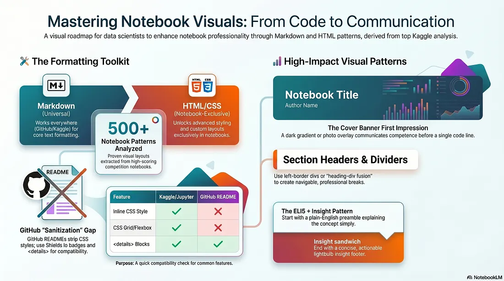

# Markdown & HTML Reference Catalog

> **Every formatting pattern for notebooks, READMEs, and documentation — with code examples and rendered outputs side by side.**



Extracted from 500+ Kaggle competition notebooks. Every pattern that actually works across Jupyter, Kaggle, GitHub, VS Code, and HackMD.

---

## 🔗 Links

| Platform | Link |
|----------|------|
| 🏆 Kaggle Notebook | [markdown-html-reference-catalog](https://www.kaggle.com/code/huseyincenik/markdown-html-reference-catalog) |
| 📝 Medium Article | [The Complete Visual Guide to Markdown & HTML Formatting](https://medium.com/@huseyinceniik/the-complete-visual-guide-to-markdown-html-formatting-in-data-science-notebooks-and-readmes-1bdc98bfa4b7) |
| ⭐ GitHub Repo | [markdown_html_reference_catalog](https://github.com/huseyincenik/markdown_html_reference_catalog) |

---

## 📋 What's Inside

The catalog is organized into 6 parts covering 60+ patterns:

| Part | Topic | Patterns |
|------|-------|----------|
| **Part 1** | Markdown Basics | Headings, text formatting, lists, blockquotes, code blocks, tables, math |
| **Part 2** | Section Headers & Banners | Gradient headers, photo banners, left-border dividers, neon headers, rules |
| **Part 3** | Callout Boxes & Alerts | Bootstrap alerts, custom note boxes, metric cards, comparison boxes |
| **Part 4** | Media & Layout | Images, video embedding, multi-column CSS grid, Google Fonts |
| **Part 5** | Professional Templates | Cover templates, upvote CTA banners, author cards, platform compatibility |
| **Part 6** | Advanced Patterns | Key findings boxes, sub-section dividers, score metric cards, model comparison tables, ELI5 templates |

---

## 🚀 Highlights

- **500+ notebooks analyzed** — patterns proven in top-scoring competition notebooks
- **Side-by-side format** — every cell shows the raw code *and* the rendered output
- **Multi-platform tested** — compatibility matrix for Kaggle, Jupyter, GitHub, VS Code, HackMD
- **Copy-paste ready** — all code examples are self-contained and production-ready
- **Anonymous & generic** — all patterns use placeholder data, no competition-specific content

---

## 📦 Repository Contents

| File | Description |
|------|-------------|
| `Kaggle_Markdown_HTML_Catalog.ipynb` | The complete 62-cell reference notebook |
| `image.png` | Visual roadmap — Mastering Notebook Visuals |
| `README.md` | This file |

---

## 💡 Key Patterns

### Cover Banner (Part 1)
Dark gradient banner with badge pills — the fastest way to make a notebook look professional.

### Dashed Key Findings Box (Part 6)
```html
<div style="padding:18px 24px; background:#fafaf9; border:1.5px dashed #a3a3a3; border-radius:10px; margin:14px 0;">
    <p style="font-size:11px; letter-spacing:2px; text-transform:uppercase; color:#737373; font-weight:600;">✏ Key findings</p>
    <ul style="font-size:14px; color:#525252; font-style:italic; line-height:1.7;">
        <li>Finding one goes here.</li>
        <li>Finding two goes here.</li>
    </ul>
</div>
```

### Score Metric Mini-Cards (Part 6)
```html
<div style="display:flex; gap:12px; flex-wrap:wrap; margin:16px 0;">
    <div style="flex:1; min-width:130px; background:#1e293b; border-radius:10px; padding:14px 18px;
                border-top:3px solid #2563eb; text-align:center;">
        <div style="font-size:11px; color:#94a3b8; text-transform:uppercase; letter-spacing:1.5px;">CV Score</div>
        <div style="font-size:26px; font-weight:800; color:#60a5fa;">0.9797</div>
    </div>
</div>
```

---

## 🛠 Build System

The notebook is generated from 6 build scripts merged by `merge_md.py`:

```
build_md_p1.py  →  md_catalog_p1.json  ─┐
build_md_p2.py  →  md_catalog_p2.json  ─┤
build_md_p3.py  →  md_catalog_p3.json  ─┤  merge_md.py  →  Kaggle_Markdown_HTML_Catalog.ipynb
build_md_p4.py  →  md_catalog_p4.json  ─┤
build_md_p5.py  →  md_catalog_p5.json  ─┤
build_md_p6.py  →  md_catalog_p6.json  ─┘
```

To rebuild:
```bash
cd markdown/
python merge_md.py
```

---

*Patterns extracted from 500+ competition notebooks · © 2026 · CC BY 4.0*
